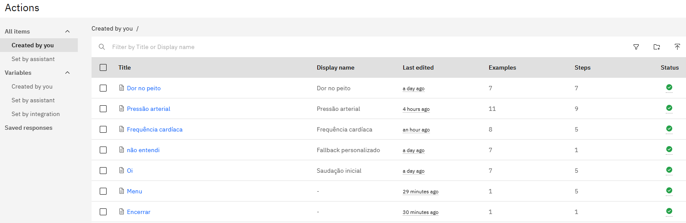
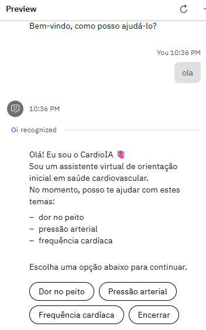
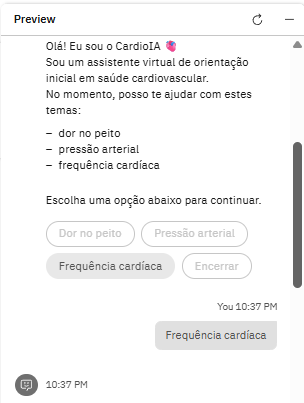
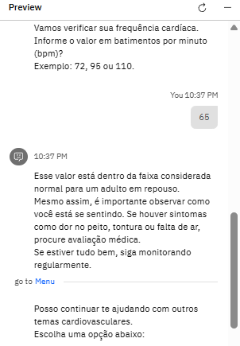
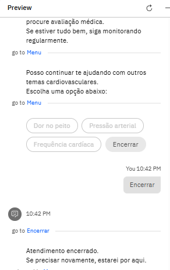

# FIAP - Faculdade de Informática e Administração Paulista

 

# Cap 1 - Assistente Cardiológico Inteligente: Experiência do Paciente

## Beginner Coders

## 👨‍🎓 Integrantes:
- <a href="https://www.linkedin.com/in/luana-porto-pereira-gomes/">Luana Porto Pereira Gomes</a>
- <a href="https://www.linkedin.com/in/luma-x">Luma Oliveira</a>
- <a href="https://www.linkedin.com/in/priscilla-oliveira-023007333/">Priscilla Oliveira </a>
- <a href="https://www.linkedin.com/in/paulobernardesqs?utm_source=share&utm_campaign=share_via&utm_content=profile&utm_medium=ios_app">Paulo Bernardes</a>

## 👩‍🏫 Professores:
### Tutor(a)
- <a href="https://www.linkedin.com/in/leonardoorabona/">Leonardo Ruiz</a>
### Coordenador(a)
- <a href="https://www.linkedin.com/in/profandregodoi/">André Godoi</a>

---

## 📌 Sobre o Projeto

Este projeto representa a evolução do CardioIA ao longo das fases do curso de Inteligência Artificial da FIAP.

Nesta etapa, deixamos de apenas analisar dados e passamos a simular uma experiência real de atendimento ao paciente, utilizando um assistente conversacional.

A proposta foi criar um chatbot capaz de conduzir uma conversa simples, coletar informações básicas de saúde e responder de forma clara e organizada, como um primeiro contato em um atendimento médico.

O foco não está apenas na tecnologia, mas na experiência: fazer o usuário se sentir guiado, entendido e bem orientado.

---

## 🎯 Objetivo

Desenvolver um assistente virtual capaz de:

.  Auxiliar usuários com dúvidas cardiovasculares básicas
.  Simular um atendimento inicial inteligente
.  Melhorar a experiência do paciente com navegação fluida
.  Demonstrar aplicação prática de IA conversacional

---

## 🤖 Sobre o IBM Watson Assistant

O IBM Watson Assistant é uma plataforma de IA conversacional que permite criar chatbots inteligentes através de:

.  Actions: fluxos principais de conversa
.  Steps: etapas dentro de cada fluxo
.  Conditions: regras de decisão
.  Subactions: navegação entre fluxos

No projeto, utilizamos:

.  Estrutura modular de ações
.  Navegação entre menus
.  Condições baseadas em entrada do usuário
.  Controle de fluxo com “Go to” e “End action”

---

## ⚙️ Arquitetura da Solução

O sistema foi desenvolvido utilizando uma arquitetura cliente-servidor para garantir escalabilidade e organização:

1.  **Frontend (HTML5/CSS3/JS):** Interface limpa onde o usuário interage com o chat.
2.  **Backend (Python + Flask):** Servidor intermediário que gerencia as requisições, trata as chaves de API e faz a ponte com o serviço de nuvem.
3.  **IBM Watson Assistant (NLP):** O motor de inteligência que processa a linguagem natural e decide o próximo passo da conversa.

**Fluxo de Dados:**
Usuário → Frontend → API Flask → IBM Watson SDK → Resposta do Bot → Frontend 

---

## 🔄 Fluxo de Navegação

O sistema foi estruturado com duas ações principais:

🟢 Oi (Entrada inicial)
  .  Saudação
  .  Apresentação do sistema
  .  Primeiro contato com o usuário
  
🟢 Menu (Navegação)
  .  Escolha de temas:
  .  Dor no peito
  .  Pressão arterial
  .  Frequência cardíaca
  .  Encerrar

Após cada resposta, o usuário retorna ao Menu, garantindo um fluxo contínuo e organizado.

---

## ❤️ Frequência Cardíaca

Fluxo:

  1. Usuário informa valor
  2. Sistema classifica:
    .  🔴 Alta (> 100 bpm)
    .  🟡 Normal (60–100 bpm)
    .  🔵 Baixa (< 60 bpm)
  3.  Retorna orientação
  4.  Redireciona para o Menu

---

## 🩺 Pressão Arterial

.  Avaliação de valores informados
.  Classificação do estado
.  Retorno ao Menu

---

## ⚠️ Dor no Peito

.  Orientações iniciais
.  Recomendações de atenção médica
.  Retorno ao Menu

---

## 🚪 Encerrar

.  Finaliza o atendimento
.  Exibe mensagem de despedida
.  Encerra a ação

---

## 🤖 Configuração do Watson Assistant

O arquivo de exportação do assistente está disponível em:

/watson/cardioia_watson_assistant.json

📥 Como importar no Watson:

1.  Acesse o IBM Watson Assistant
2.  Vá em Import/Export
3.  Clique em Import
4.  Selecione o arquivo JSON
   
O assistente será carregado com todos os fluxos

---

## 📸 Demonstração do Assistente

Nesta seção, apresentamos o funcionamento do CardioIA através de capturas de tela do ambiente de testes da IBM e da estrutura de IA.

### 1. Painel de Controle (IBM Watson Assistant)
Abaixo, a estrutura modular do assistente. Note a organização das intenções principais (`Dor no peito`, `Pressão arterial`, `Frequência cardíaca`) e o tratamento de exceções com o fluxo de **Fallback personalizado** ("não entendi").

---

### 2. Fluxo de Boas-Vindas e Identificação
A jornada do paciente inicia com uma recepção amigável. O sistema reconhece a entrada do usuário (ex: "ola") e aciona a saudação inicial para estabelecer o contexto do atendimento.

---

### 3. Menu Interativo de Opções
O assistente apresenta o escopo de atuação do CardioIA e oferece botões interativos para facilitar a navegação, garantindo que o usuário saiba exatamente como o assistente pode ajudá-lo.

---

### 4. Coleta de Dados e Orientação (Ex: Frequência Cardíaca)
Demonstração da inteligência do bot: ao receber um valor de bpm (65), o sistema classifica como "normal", fornece orientações preventivas e, seguindo boas práticas éticas, recomenda atenção a outros sintomas antes de retornar ao Menu.

---

### 5. Finalização de Atendimento
O fluxo de encerramento garante que o paciente tenha uma despedida clara e saiba que o canal permanece aberto para futuras dúvidas.

---

## 🚀 Como Executar o Projeto

### Pré-requisitos
* Python 3.x instalado.

### Passo a Passo
1.  **Configuração do Watson:** * Acesse o IBM Watson Assistant.
    * Realize o upload do arquivo: `/watson/cardioia-assistant-action-v1.json`.
2.  **Preparação do Backend:** * Navegue até a pasta: `cd backend`.
    * Instale as bibliotecas necessárias usando o arquivo de requisitos:
      `pip install -r requirements.txt`
3.  **Configuração de Credenciais:** * No arquivo `app.py`, certifique-se de configurar suas chaves de API (API Key e Service URL) do Watson.
4.  **Execução:** * Inicie o servidor: `python app.py`.
5.  **Interação:** * Abra o arquivo `frontend/index.html` em seu navegador para iniciar o chat.

---

## 🧩 Tecnologias Utilizadas
.  IBM Watson Assistant
.  JavaScript / Frontend (se aplicável)
.  HTML / CSS
.  GitHub

---

## Links:
[🔗 Clique aqui para assistir ao vídeo](         )  

---

## 📁 Estrutura de Pastas
├── assets/             # Imagens e logos da documentação
├── backend/            # Lógica do servidor em Python
│   ├── app.py
│   └── requirements.txt
├── frontend/           # Interface do usuário
│   └── index.html
├── watson/             # Exportação da inteligência do assistente
│   └── cardioia-assistant-action-v1.json
├── .gitignore          # Arquivos ignorados pelo Git
└── README.md
---

## 🗃 Histórico de lançamentos
0.5.0 - Fase 5 - Assistente Conversacional com Watson
0.4.0 - Evolução do sistema
0.3.0 - Integração de dados
0.2.0 - Modelagem inicial
Estrutura inicial do projeto

---

## 🏁 Conclusão

O CardioIA evoluiu de um sistema de análise de dados para um assistente inteligente interativo, demonstrando na prática como a IA pode melhorar a experiência do paciente.

A utilização do Watson Assistant permitiu:

.  Navegação fluida
.  Respostas dinâmicas
.  Estrutura organizada de atendimento

---

## 📌 Observações

.  Projeto com fins educacionais
.  Não substitui avaliação médica
.  As orientações são informativas

> **⚠️ Nota de Governança e Ética:** Este assistente foi projetado seguindo as boas práticas de saúde digital, incluindo um "Fluxo de Fallback" para situações de dúvida e o uso de "Disclaimers" obrigatórios, reforçando que o sistema é uma ferramenta de apoio informativo e nunca substitutivo ao diagnóstico médico profissional.

---

## 📋 Licença

<a property="dct:title" rel="cc:attributionURL" href="https://github.com/agodoi/template">MODELO GIT FIAP</a> por <a rel="cc:attributionURL dct:creator" property="cc:attributionName" href="https://fiap.com.br">Fiap</a> está licenciado sobre <a href="http://creativecommons.org/licenses/by/4.0/?ref=chooser-v1" target="_blank" rel="license noopener noreferrer" style="display:inline-block;">Attribution 4.0 International</a>.

